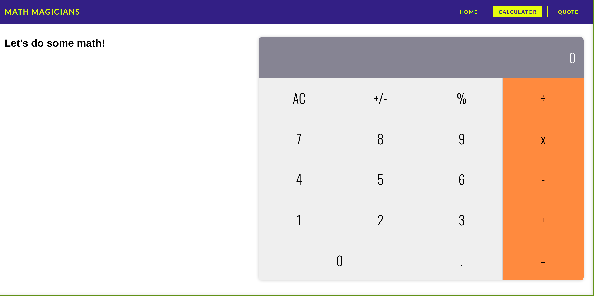

# Math Magicians

> Math Magicians - Calculator User Interface & functionality

This is just a simple calculator user interface that I built using the [React](https://reactjs.org/) framework.

## Built With

- HTML, CSS, and JavaScript
- [React](https://reactjs.org/)

To get a local copy up and running follow these simple example steps.

### Setup

To setup the project in your local, in the repo page:
click on code (dropdown list) > Download as ZIP.
or open terminal of path you want to install project and run this command  
`git clone https://github.com/Amrhub/math-magicians.git`  
`cd math-magicians`

### Deployment

To run the project open folder (after extraction) or cloning then run these commands:  
**`npm install`** to install all dependencies  
**`npm start`** to start the application, you should see the application working at: `http://localhost:3000/`

## Authors

👤 **Amr Ahmed**

- GitHub: [@Amrhub](https://github.com/Amrhub/)
- LinkedIn: [Amr Ahmed](https://www.linkedin.com/in/amr-ahmed-655420191/)

## 🤝 Contributing

Contributions, issues, and feature requests are welcome!

Feel free to check the [issues page](../../issues/).

## Show your support

Give a ⭐️ if you like this project!

## Acknowledgments

- [React](https://reactjs.org/)
- [Microverse](https://microverse.org/)⭐️ helped me to learn React.

## Learn More about React

You can learn more in the [Create React App documentation](https://facebook.github.io/create-react-app/docs/getting-started).

To learn React, check out the [React documentation](https://reactjs.org/).

### Code Splitting

This section has moved here: [https://facebook.github.io/create-react-app/docs/code-splitting](https://facebook.github.io/create-react-app/docs/code-splitting)

### Analyzing the Bundle Size

This section has moved here: [https://facebook.github.io/create-react-app/docs/analyzing-the-bundle-size](https://facebook.github.io/create-react-app/docs/analyzing-the-bundle-size)

### Making a Progressive Web App

This section has moved here: [https://facebook.github.io/create-react-app/docs/making-a-progressive-web-app](https://facebook.github.io/create-react-app/docs/making-a-progressive-web-app)

### Advanced Configuration

This section has moved here: [https://facebook.github.io/create-react-app/docs/advanced-configuration](https://facebook.github.io/create-react-app/docs/advanced-configuration)

### Deployment

This section has moved here: [https://facebook.github.io/create-react-app/docs/deployment](https://facebook.github.io/create-react-app/docs/deployment)

### `yarn build` fails to minify

This section has moved here: [https://facebook.github.io/create-react-app/docs/troubleshooting#npm-run-build-fails-to-minify](https://facebook.github.io/create-react-app/docs/troubleshooting#npm-run-build-fails-to-minify)

## 📝 License

This project is [MIT](./MIT.md) licensed.
